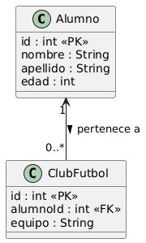

# Base de Datos 
## Estructura del proyecto
```
G:.
│   docker-compose.yml
│   .env
│   README.md
│   CapturaUML.PNG
│   
└───alejandrorod
    │   pom.xml
    │   
    └───src
        ├───main
        │   ├───java
        │   │   └───es
        │   │       └───etg
        │   │           └───ad
        │   │               └───dam
        │   │                       Main.java
        │   │                       InstitutoDAO.java
        │   │                       InstitutoSQLiteDAOImp.java
        │   │                       Alumno.java
        │   │                       Modo.java
        │   │                       InstitutoDAOFactory.java
        │   │                       InstitutoMockDAOImp.java
        │   │                       InstitutoOracleXeDAOImp.java
        │   │                       ClubFutbol.java
        │   │                       InstitutoDAOBase.java
        │   │
        │   └───resources
        │       └───es
        │           └───etg
        │               └───ad
        │                   └───dam
        │                           mybasedatos.db
        │
        └───test
            └───java
```
## Menús para el control de la base de datos
```java
try (Scanner sc = new Scanner(System.in)) {
            InstitutoDAO dao = null;

            while (true) {
                System.out.println("====== MENU 1: TIPO DE CONEXIÓN ======");
                System.out.println("1. Mock");
                System.out.println("2. SQLite");
                System.out.println("3. Oracle");
                System.out.println("0. Salir");
                System.out.print("Elige opción: ");

                int op = leerInt(sc);
                if (op == 0) {
                    break;
                }

                dao = seleccionarDAO(op);
                if (dao == null) {
                    continue;
                }

                // Precargar datos automáticamente si usamos SQLite
                if (op == 2) {
                    ((InstitutoSQLiteDAOImp) dao).crearTablaAlumno();
                    ((InstitutoSQLiteDAOImp) dao).crearTablaClubFutbol();
                    ((InstitutoSQLiteDAOImp) dao).insertarDatosIniciales();
                    System.out.println("\n*** Tablas creadas y datos precargados ***\n");
                }

                System.out.println("\n*** Conexión establecida ***\n");
                menuSecundario(sc, dao);
            }
        }
    }

    private static int leerInt(Scanner sc) {
        while (true) {
            try {
                int num = sc.nextInt();
                sc.nextLine(); // limpiar buffer
                return num;
            } catch (InputMismatchException e) {
                System.out.print("Entrada inválida. Introduce un número: ");
                sc.nextLine(); // limpiar buffer
            }
        }
    }

    private static InstitutoDAO seleccionarDAO(int op) throws Exception {
        return switch (op) {
            case 1 ->
                new InstitutoMockDAOImp();
            case 2 ->
                new InstitutoSQLiteDAOImp();
            case 3 ->
                new InstitutoOracleXeDAOImp();
            default -> {
                System.out.println("Opción inválida");
                yield null;
            }
        };
    }
```
Este menú se emplea para se emplea para seleccionar entre las distintas formas de acceder a la base de datos.

```java
public enum Modo {
    MOCK,
    SQLITE,
    ORACLE
}
```
Mediante esta enumeración escogeremos el modo de conexión a la base de datos.
```java
private static void menuSecundario(Scanner sc, InstitutoDAO dao) {
        while (true) {
            System.out.println("\n====== MENU 2 ======");
            System.out.println("1. Crear tablas");
            System.out.println("2. Insertar alumno");
            System.out.println("3. Insertar club");
            System.out.println("4. Actualizar alumno");
            System.out.println("5. Actualizar club");
            System.out.println("6. Listar alumnos");
            System.out.println("7. Listar alumnos con club (JOIN)");
            System.out.println("8. Buscar alumno por ID");
            System.out.println("0. Volver");
            System.out.print("Elige opción: ");

            int op2 = leerInt(sc);
            if (op2 == 0) {
                break;
            }

            switch (op2) {
                case 1 -> {
                    dao.crearTablaAlumno();
                    dao.crearTablaClubFutbol();
                    System.out.println("Tablas creadas correctamente.");
                }
                case 2 ->
                    insertarAlumno(sc, dao);
                case 3 ->
                    insertarClub(sc, dao);
                case 4 ->
                    actualizarAlumno(sc, dao);
                case 5 ->
                    actualizarClub(sc, dao);
                case 6 ->
                    dao.listarAlumnos().forEach(System.out::println);
                case 7 ->
                    dao.listarAlumnosConClub().forEach(System.out::println);
                case 8 ->
                    buscarAlumno(sc, dao);
                default ->
                    System.out.println("Opción inválida");
            }
        }
    }
```
Este segundo menú se emplea para seleccionar la acción que quieras realizar en la base de datos, crear una tabla, intertar alumnos o clubs, actualizarlos, listarlos o buscar un alumno en específico,
## Diagrama uml


## Relación entre Alumno y Club de Fútbol


### Cargar datos iniciales
Para no comenzar con la base de datos vacía, insertamos unos datos iniciales, en este caso jugadores y clubes del juego **Inazuma Eleven**.
```java
public void insertarDatosIniciales() {
        insertarAlumno(new Alumno(0, "Mark", "Evans", 22));
        insertarAlumno(new Alumno(0, "Axel", "Blaze", 22));
        insertarAlumno(new Alumno(0, "Byron", "Love", 21));
        insertarAlumno(new Alumno(0, "Aitor", "Cazador", 23));
        insertarAlumno(new Alumno(0, "Harper", "Evans", 20));
        insertarAlumno(new Alumno(0, "Victor", "Blade", 24));
        insertarAlumno(new Alumno(0, "Sol", "Daystar", 22));

        insertarClub(new ClubFutbol(0, 1, "Instituto Raimon"));
        insertarClub(new ClubFutbol(0, 2, "Royal Academy"));
        insertarClub(new ClubFutbol(0, 3, "Phoenix Club"));
        insertarClub(new ClubFutbol(0, 4, "Dragon Team"));
        insertarClub(new ClubFutbol(0, 5, "Star Eagles"));
        insertarClub(new ClubFutbol(0, 6, "Shadow Wolves"));
        insertarClub(new ClubFutbol(0, 7, "Sun Strikers"));
    }
```
### Factoria
```java
public class InstitutoDAOFactory {

    public static InstitutoDAO obtenerDAO(Modo modo) throws Exception {
        return switch (modo) {
            case SQLITE ->
                new InstitutoSQLiteDAOImp();
            case ORACLE ->
                new InstitutoOracleXeDAOImp();
            default ->
                new InstitutoMockDAOImp();
        };
    }
}
```
- **Propósito:**
  - Es una fábrica de objetos (Factory) que crea instancias de `InstitutoDAO` según el tipo de conexión.
  - Permite ocultar la implementación concreta y trabajar solo con la interfaz `InstitutoDAO`.

- **Método principal: `obtenerDAO(Modo modo)`**
  - Recibe un parámetro `Modo` que indica el tipo de conexión deseada:
    - `MOCK` → base de datos de prueba en memoria
    - `SQLITE` → base de datos SQLite
    - `ORACLE` → base de datos Oracle
  - Devuelve un objeto que implementa `InstitutoDAO` según el modo:
    - `SQLITE` → `InstitutoSQLiteDAOImp`
    - `ORACLE` → `InstitutoOracleXeDAOImp`
    - `MOCK` u otro → `InstitutoMockDAOImp`

- **Ventajas de usar Factory:**
  - Desacopla la creación de objetos de su uso.
  - Permite cambiar la implementación sin tocar la lógica que usa `dao`.
  - Facilita la mantenibilidad y escalabilidad del código.
  - Se sigue el principio de programar contra interfaces, no implementaciones.

### Interfaz
```java
import java.util.List;

public interface InstitutoDAO {

    void crearTablaAlumno();

    void crearTablaClubFutbol();

    int insertarAlumno(Alumno alumno);

    int actualizarAlumno(Alumno alumno);

    int borrar(Alumno alumno);

    Alumno buscarAlumnoPorId(int id);

    List<Alumno> listarAlumnos();

    List<Alumno> listarAlumnos(int edad);

    int insertarClub(ClubFutbol club);

    int actualizarClub(ClubFutbol club);

    List<String> listarAlumnosConClub();
}

```
La interfaz **`InstitutoDAO`** actúa como una **capa de abstracción** en el proyecto, definiendo todas las operaciones posibles sobre los datos del instituto, como crear tablas, insertar, actualizar, borrar y consultar alumnos y clubes de fútbol. Su gran ventaja es que permite a la aplicación trabajar con **una única interfaz**, sin preocuparse de **cómo o dónde se almacenan los datos** —ya sea en memoria para pruebas (*Mock*), en SQLite o en Oracle—, lo que facilita cambiar la implementación concreta de la base de datos sin afectar la lógica del resto del programa.


- **Objetivo principal del proyecto:**
  - Gestionar alumnos y clubes de fútbol, permitiendo crear, actualizar, borrar y consultar registros.
  - Soportar múltiples tipos de conexión a datos (Mock en memoria, SQLite o Oracle) sin que la lógica de la aplicación cambie.
  - Separar la lógica de negocio de la persistencia de datos, utilizando una interfaz (`InstitutoDAO`) y diferentes implementaciones según la base de datos.
  - Facilitar pruebas y mantenimiento, permitiendo cambiar de base de datos o probar funcionalidades sin depender de una implementación concreta.

### Guía 
1. **Crear el proyecto**
   - Crea un proyecto Maven/Java.
   - Define el package principal, por ejemplo: `es.etg.ad.dam`.
   - Crea las carpetas `src/main/java` y `src/main/resources`.

2. **Definir las clases base**
   - `Alumno.java` → campos: `id`, `nombre`, `apellido`, `edad`.
   - `ClubFutbol.java` → campos: `id`, `alumnoId` (FK), `equipo`.
   - `Modo.java` → enum: `MOCK`, `SQLITE`, `ORACLE`.

3. **Crear la interfaz DAO**
   - `InstitutoDAO.java` → define métodos para:
     - Crear tablas (`crearTablaAlumno()`, `crearTablaClubFutbol()`).
     - CRUD de alumnos (`insertarAlumno`, `actualizarAlumno`, `borrar`, `listar`, `buscarPorId`).
     - CRUD de clubes (`insertarClub`, `actualizarClub`, `listarAlumnosConClub()`).

4. **Implementar las diferentes versiones del DAO**
   - `InstitutoMockDAOImp.java` → datos en memoria para pruebas.
   - `InstitutoSQLiteDAOImp.java` → conexión SQLite:
     - Crear tablas si no existen.
     - Implementar todos los métodos de la interfaz usando SQL.
   - `InstitutoOracleXeDAOImp.java` → conexión Oracle:
     - Hereda de SQLiteDAO para reusar código base.
     - Reemplaza la conexión SQLite por Oracle en el constructor.

5. **Crear la fábrica de DAOs**
   - `InstitutoDAOFactory.java` → método `obtenerDAO(Modo modo)`:
     - Devuelve la implementación correcta según el `Modo` elegido.
     - Permite cambiar la base de datos sin modificar la lógica de la aplicación.

6. **Crear la clase Main**
   - Mostrar **Menú 1** para elegir el tipo de conexión.
   - Mostrar **Menú 2** para realizar operaciones:
     - Crear tablas
     - Insertar/Actualizar alumnos y clubes
     - Listar registros
     - Consultas por parámetros (ej. buscar alumno por ID)
   - Llamar siempre a los métodos a través de la **interfaz `InstitutoDAO`**, sin preocuparse de la implementación concreta.

7. **Gestionar la base de datos**
   - Para SQLite: incluir archivo `mybasedatos.db` en `resources`.
   - Para Oracle: configurar usuario, contraseña y URL en el constructor de `InstitutoOracleXeDAOImp`.
   - Asegurarse de que las **FK** (`alumnoId` → `Alumno.id`) estén correctamente definidas.

8. **Probar el proyecto**
   - Ejecutar `Main.java`.
   - Probar los tres modos: **Mock, SQLite y Oracle**.
   - Insertar datos y listar resultados para verificar que todo funcione correctamente.

9. **Extras opcionales**
   - Crear métodos adicionales en DAO según nuevas tablas.
   - Precargar datos iniciales para pruebas.

Siguiendo estos campos conseguiremos crear el proyecto desde cero, para posteriormente empleando docker poder usar esta base de datos en esta simulación para practicar las distintas bases de datos y como se definen y emplean mediante una conexión y controlandola desde Visual.

### Problemas
Tras conseguir definir correctamente las clases, alumno y club de futbol el único problema a la hora de probar la base de datos ha sido mediante docker debido a que me daba fallo en el puerto de acceso apesar de estar realizado correctamente. El no haber podido realizar esa parte ha hecho que no pueda comprobar si la conexión a **OracleXE** funcionaba de manera correcta , aunque basado en estructuras de proyectos de compañeros puedo confirmar que el codigo es correcto.